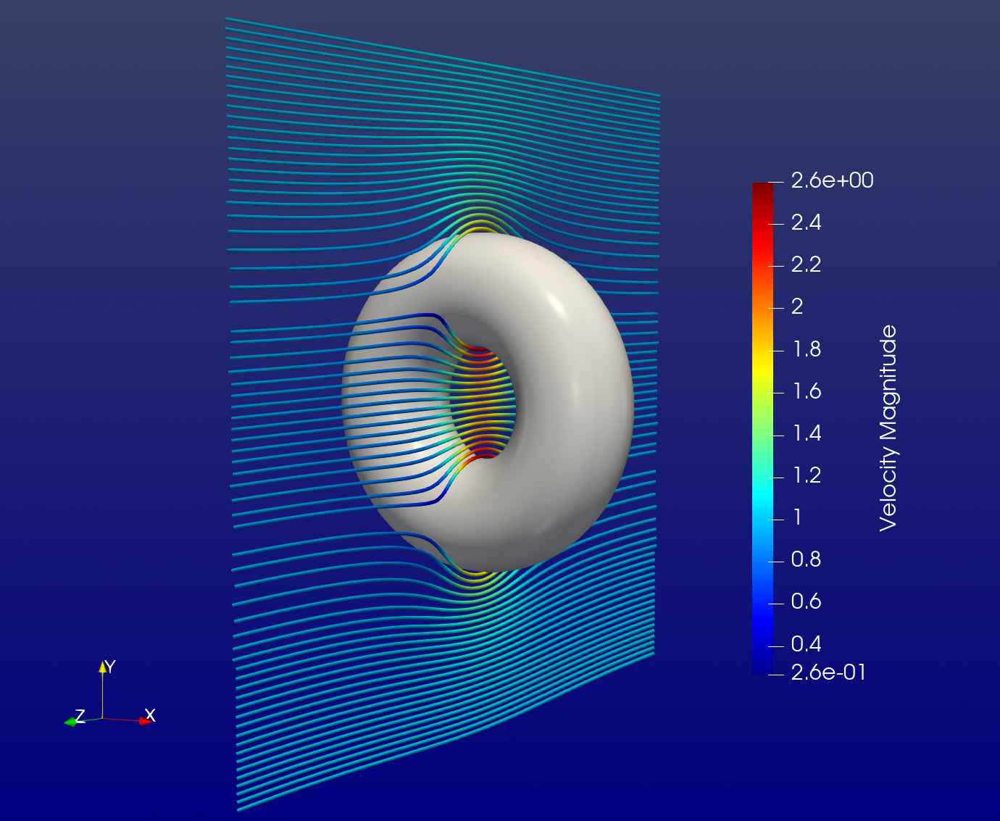

# ImmersedPotentialFlowModule

This module implements an immersed Galerkin discretization of the [Potential flow](https://en.wikipedia.org/wiki/Potential_flow) with (non)homogenous Dirichlet and Neumann boundary conditions.


[./examples/immersed\_potentialflow/rotating\_cylinder.jl](https://gitlab.com/m1ka05/taiga.jl/-/blob/main/examples/immersed_potentialflow/rotating_cylinder.jl)



[./examples/immersed_potentialflow/torus.jl](https://gitlab.com/m1ka05/taiga.jl/-/blob/main/examples/immersed_potentialflow/torus.jl)


# Index

```@autodocs
Modules = [ImmersedPotentialFlowModule]
Order   = [:type, :function]
```